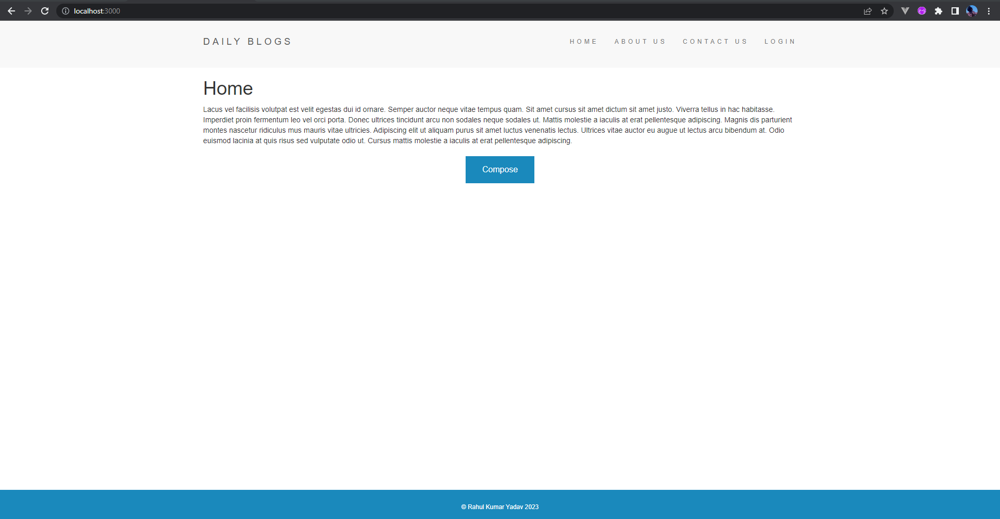
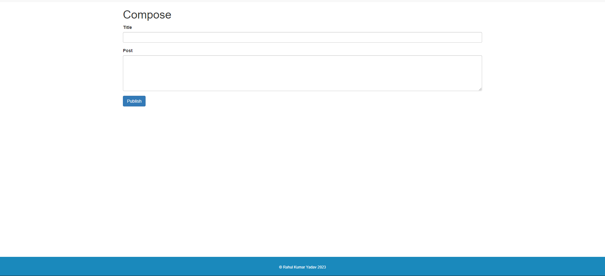
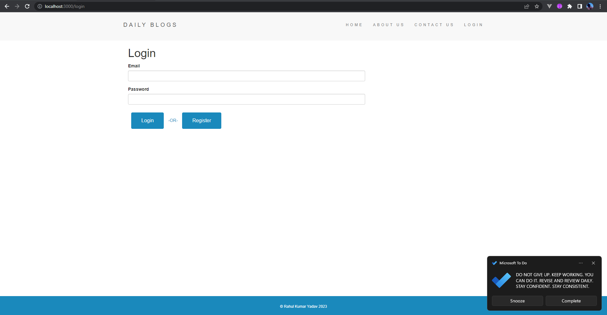
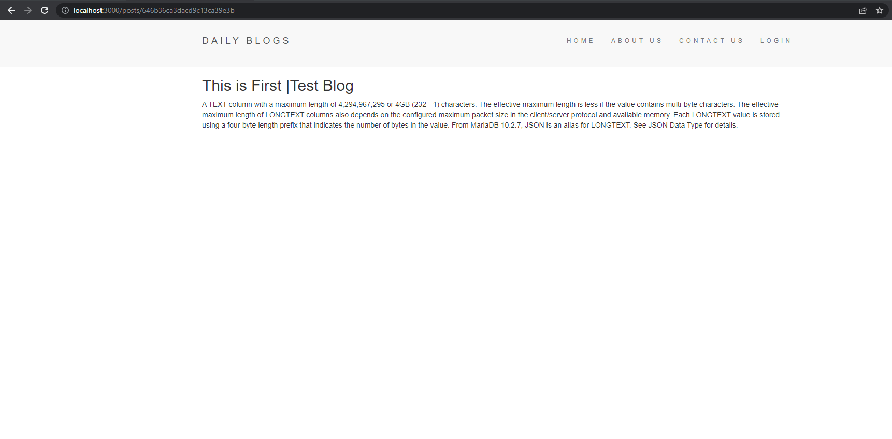
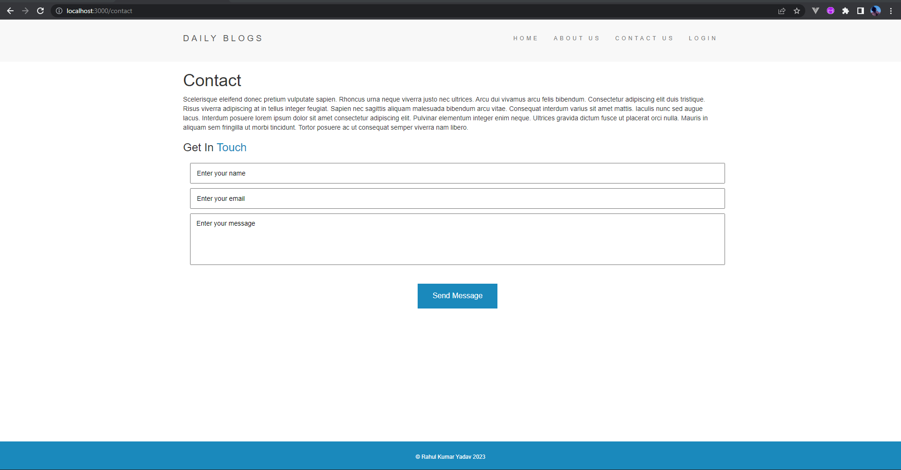

# DailyBlogs
# Daily Blog Website

## Description
The Daily Blog Website is a web application that allows users to create, read, and publish blog posts. Users can register an account, log in, and start composing their blog posts. The website provides various features such as composing, editing, and deleting blog posts, as well as viewing individual blog posts and reading posts from other users. It is built using Node.js, Express.js, and MongoDB as the backend stack, and it uses EJS as the templating engine for rendering views. The website incorporates user authentication using bcrypt for password hashing and mongoose for interacting with the MongoDB database.

## Features
- User registration: Users can create an account by providing their email address and password.
- User login: Registered users can log in to their accounts using their credentials.
- Compose blog posts: Authenticated users can create new blog posts by providing a title and the content of the post.
- View home page: The home page displays a list of all the blog posts created by users, including the title and a truncated version of the content.
- View full blog post: Users can click on a blog post title to view the full content of that particular post.
- Edit and delete posts: Logged-in users have the option to edit or delete their own blog posts.
- About page: The about page provides information about the website and its purpose.
- Contact page: The contact page displays contact information for getting in touch with the website owners.

## Installation
To run the Daily Blog Website locally, follow these steps:

1. Ensure that you have Node.js and MongoDB installed on your system.
2. Clone the repository or download the source code.
3. Open a terminal or command prompt and navigate to the project directory.
4. Install the dependencies by running the command: `npm install`
5. Start the MongoDB server on your local machine.
6. Launch the application by running the command: `npm start`
7. Open a web browser and visit `http://localhost:3000` to access the Daily Blog Website.

## Dependencies
The following dependencies are used in this project:

- express: Fast, unopinionated web framework for Node.js.
- body-parser: Middleware for handling HTTP request bodies.
- ejs: Embedded JavaScript templates for rendering views.
- lodash: Utility library that provides helpful functions for working with arrays, objects, and more.
- mongoose: MongoDB object modeling tool designed to work in an asynchronous environment.
- bcrypt: Library for hashing passwords and comparing hashes.
- nodemon: Development utility that automatically restarts the server upon file changes (dev dependency).

## Usage
- Upon accessing the website, users can register a new account or log in with their existing credentials.
- After logging in, users are redirected to the home page where they can view the list of blog posts.
- Clicking on a blog post title will navigate to the full post view, displaying the complete content.
- Users can compose new blog posts by clicking the "Compose" button and providing a title and content.
- On the home page, users have the option to edit or delete their own posts by clicking the corresponding buttons.
- The about and contact pages provide additional information and contact details.

## Contribution
Contributions to the Daily Blog Website are welcome! If you find any bugs or want to enhance the functionality, you can follow these steps:

1. Fork the repository.
2. Create a new branch for your feature or bug fix.
3. Make the necessary changes and commit them.
4. Push your changes to your fork.
5. Submit a pull request with a description of your changes.

## License
The Daily Blog Website is open-source software licensed under the [MIT license](https://opensource.org/licenses/MIT).

## Credits
The Daily Blog Website was created

## Screenshots

